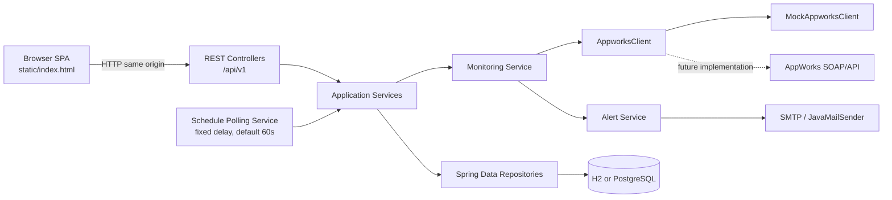
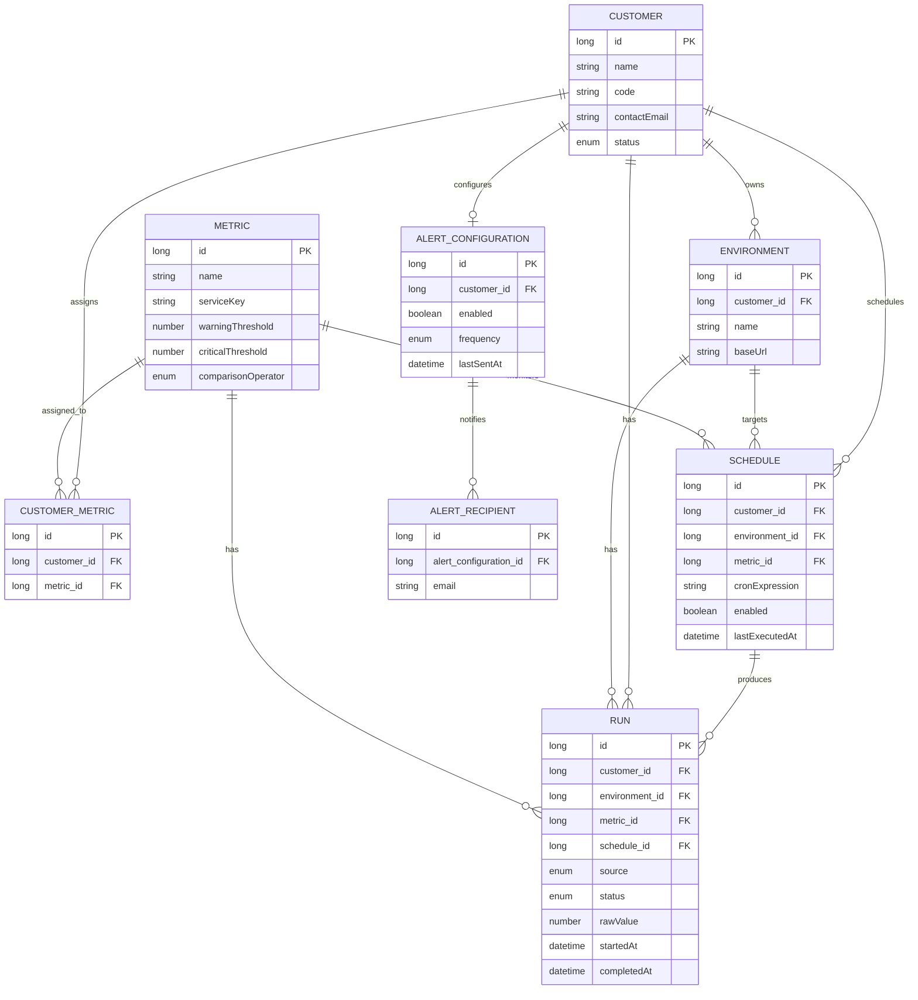

# AppWorks Support Portal Architecture

## 1. System Overview

The AppWorks Support Portal is a Spring Boot 3.3 application that provides a REST API and a browser-based monitoring dashboard. It manages customers, environments, metrics, schedules, monitoring runs, and alert recipients.

The application is deployed as a single process:

- Spring Boot serves the REST API under `/api/v1`.
- Spring Boot serves the static single-page frontend from `src/main/resources/static/index.html`.
- Spring Data JPA and Hibernate persist the domain model.
- A scheduled polling service executes due monitoring schedules.
- An integration interface isolates the monitoring engine from the real AppWorks implementation.



## 2. Runtime Layers

### Presentation layer

Package: `com.appworks.portal.controller`

Controllers expose JSON endpoints and delegate business operations to services. The current controllers are:

- `CustomerController`: customer CRUD.
- `EnvironmentController`: environments nested under a customer.
- `CustomerMetricController`: assign and manage metrics for a customer.
- `MetricController`: global metric catalog CRUD.
- `ScheduleController`: schedule CRUD and enable/disable operations.
- `RunController`: manual runs, recent runs, and filterable paginated history.
- `DashboardController`: summary, customer health, and metric status views.

DTOs in `com.appworks.portal.dto` define request and response contracts so persistence entities are not exposed as the API contract.

### Application/service layer

Package: `com.appworks.portal.service`

Services contain business rules and transaction boundaries:

- `CustomerService`, `EnvironmentService`, `MetricService`, and `CustomerMetricService` manage configuration data.
- `ScheduleService` validates schedule ownership, metric assignment, uniqueness, and cron normalization.
- `MonitoringService` is the shared execution engine for manual and scheduled runs.
- `SchedulePollingService` finds enabled schedules that are due and delegates execution to `MonitoringService`.
- `DashboardService` builds operational summary and health projections.
- `AlertService` applies alert configuration and frequency throttling, then logs or sends email notifications.

### Persistence layer

Package: `com.appworks.portal.repository`

Spring Data repositories provide CRUD and query operations for the domain entities. `RunRepository` also implements `JpaSpecificationExecutor`; `RunSpecifications` builds optional run-history predicates only when filters are present. This avoids ambiguous null parameters with PostgreSQL.

### Integration layer

Package: `com.appworks.portal.integration`

`AppworksClient` is the boundary used by the monitoring engine. `MockAppworksClient` is the current implementation and returns deterministic results based on the customer, environment, and metric. A real AppWorks SOAP/API client can be added behind the same interface when endpoint, WSDL, and authentication details are available.

### Error handling

Package: `com.appworks.portal.exception`

Domain-specific exceptions represent missing resources, invalid requests, duplicate resources, and resources that cannot be deleted because they are in use. `GlobalExceptionHandler` converts these exceptions into consistent HTTP error responses.

## 3. Domain Model



Important data rules:

- Customers use soft-delete by changing status to `INACTIVE`, preserving related history.
- A customer can only run metrics assigned through `CustomerMetric`.
- A schedule targets one customer, environment, and metric combination.
- Schedule cron input accepts five-field Unix cron and is normalized to Spring's six-field format.
- Run status is evaluated as `PASS`, `WARNING`, `FAIL`, or `ERROR`.
- Alert notifications are skipped for `PASS` and throttled according to `EVERY_FAILURE`, `HOURLY`, or `DAILY` configuration.
- Deleting a schedule detaches existing runs from that schedule so run history remains available.

## 4. Monitoring Execution Flow

### Scheduled execution

1. `SchedulePollingService` polls enabled schedules at the configured fixed delay.
2. For each schedule, it calculates the next cron time after `lastExecutedAt` (or a recent baseline for a never-executed schedule).
3. Due schedules are passed to `MonitoringService.executeSchedule`.
4. `MonitoringService` calls the injected `AppworksClient`.
5. The returned value is evaluated against the metric thresholds.
6. A `Run` record is saved with timing, source, status, value, output, or error details.
7. `AlertService` evaluates the result and sends or logs an alert when appropriate.
8. The schedule's `lastExecutedAt` is updated.

### Manual execution

`POST /api/v1/runs` follows the same monitoring path. It validates the customer, environment ownership, and customer-to-metric assignments, then creates one manual run for each distinct requested metric.

## 5. API Surface

| Area | Base path | Responsibility |
| --- | --- | --- |
| Customers | `/api/v1/customers` | Customer CRUD and nested resources |
| Environments | `/api/v1/customers/{customerId}/environments` | Customer environment management |
| Customer metrics | `/api/v1/customers/{customerId}/metrics` | Metric assignment management |
| Metrics | `/api/v1/metrics` | Global metric catalog |
| Schedules | `/api/v1/schedules` | Scheduled monitoring configuration |
| Runs | `/api/v1/runs` | Manual execution and recent history |
| Run history | `/api/v1/runs/history` | Filtered and paginated run history |
| Dashboard | `/api/v1/dashboard` | Summary and health projections |

The frontend and API use the same origin, so the current deployment does not require CORS configuration.

## 6. Data and Configuration

### Database profiles

- Default profile: H2 in-memory database for zero-setup local startup.
- `postgres` profile: PostgreSQL using the `org.postgresql.Driver` and Hibernate's PostgreSQL dialect.
- JPA schema management currently uses `ddl-auto: update`.

The PostgreSQL connection is configured in `src/main/resources/application.yml`. `src/main/resources/application-example.yml` provides an environment-variable-based template using `DB_URL`, `DB_USERNAME`, and `DB_PASSWORD`.

### Email alerts

Email delivery uses Spring's `JavaMailSender` and is disabled by default with `app.alerts.email-enabled: false`. When enabled, SMTP settings come from `spring.mail.*`; the example configuration uses `SMTP_HOST`, `SMTP_PORT`, `SMTP_USERNAME`, and `SMTP_PASSWORD`. SMTP failures are logged and do not fail the monitoring run.

### Key runtime settings

| Setting | Default | Purpose |
| --- | --- | --- |
| `server.port` | `8080` | HTTP server port |
| `app.scheduler.poll-ms` | `60000` | Schedule polling delay |
| `app.alerts.email-enabled` | `false` | Enables real SMTP delivery |
| `app.alerts.from-address` | `noreply@supportportal.local` | Alert sender address |

## 7. Source Layout

```text
src/main/java/com/appworks/portal/
├── controller/       REST endpoints
├── dto/              API request and response models
├── entity/           JPA entities and enums
├── exception/        Domain exceptions and HTTP error mapping
├── integration/      AppWorks client boundary and mock implementation
├── repository/       Spring Data repositories and run specifications
├── service/          Business logic, monitoring, scheduling, and alerts
└── SupportPortalApplication.java

src/main/resources/
├── application.yml           Default and PostgreSQL configuration
├── application-example.yml   Environment-variable configuration template
└── static/index.html          Same-origin single-page frontend
```

## 8. Deployment Shape

The application is packaged as a Spring Boot executable JAR and can run with Java 21:

```text
Browser -> Spring Boot application -> H2 or PostgreSQL
                              \-> SMTP (optional)
                              \-> AppWorks integration (mock today)
```

For local development:

```bash
mvn clean install
mvn spring-boot:run
```

For PostgreSQL:

```bash
mvn spring-boot:run -Dspring-boot.run.profiles=postgres
```

## 9. Current Boundaries and Future Work

- The AppWorks client is deterministic and mocked; a production client still needs the real protocol and authentication details.
- Authentication and authorization are not currently implemented.
- List endpoints do not all provide pagination.
- Database migrations, API documentation, metrics, tracing, and rate limiting are not yet configured.
- The schedule poll interval bounds execution timing; schedules may execute slightly after their cron time.